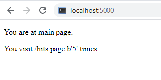
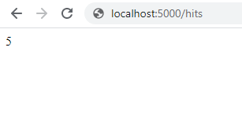
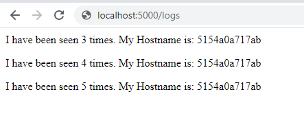

# Лабораторна

1. Спробував чи проєкт є працездатним перейшовши у папку та після ініціалізації середовища виконав команди записані нижче:
    ```
    pipenv --python 3.9
    pipenv install -r requirements.txt
    pipenv run python3 app.py
    ```
2. Ініціалузував середовище для тестів у іншій вкладці шелу та запустив їх командою:
    ```
    pipenv run pytest test_app.py --url http://localhost:5000
    ```
3. Тести були невдалі тому що не було запущено redis-server

4. Ознайомився з вмістом Dockerfile та Makefile. Що означають директиви Makefile:  
    1)STATES - змінна для зберігання директив;  
    2)REPO - змінна для зберігання назви Docker репозиторію;  
    3).PHONY - дозволяє оголошувати фальшиві цілі;  
    4)$(STATES) - директива для білда контейнера;  
    5)run - директива для створення мережі;  
    6)test-app - директива для запуску контейнера з моніторингом;  
    7)docker-prune - видалення контейнерів, волюмів, мереж та імеджів.

5. Запустив додаток та тест, тести пройшли успішно.
    
    
    

6. Дві мережі: public - мережа з якої можуть підключатись користувачі та  
    secret - для доступу до redis.

7. Веб-сайт працює. У браузері потрібно зайти на адресу localhost:80.

8. Зручніше використувати `docker-compose` для створення та запуску імеджів.

9. Посилання на мій Docker репозиторій: 
   - [lab5](https://hub.docker.com/repository/docker/mixapaco/lab5)

10. Посилання на мій Docker репозиторій: 
   - [lab4](https://hub.docker.com/repository/docker/mixapaco/lab4)
